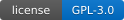
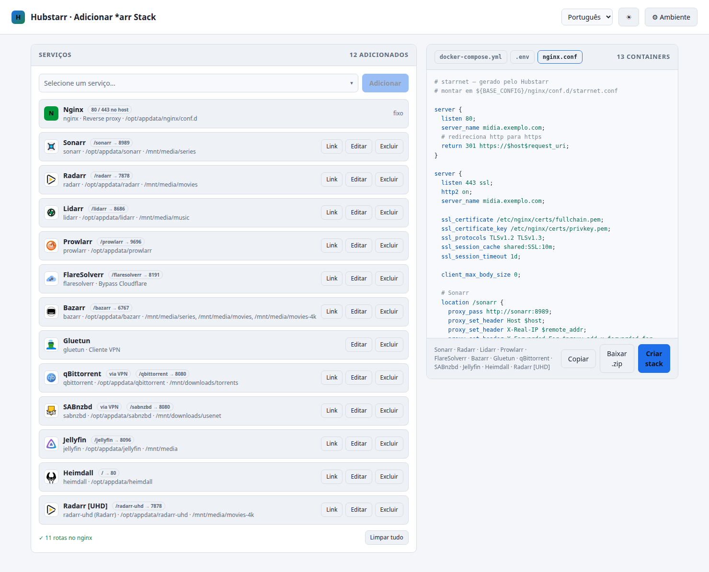
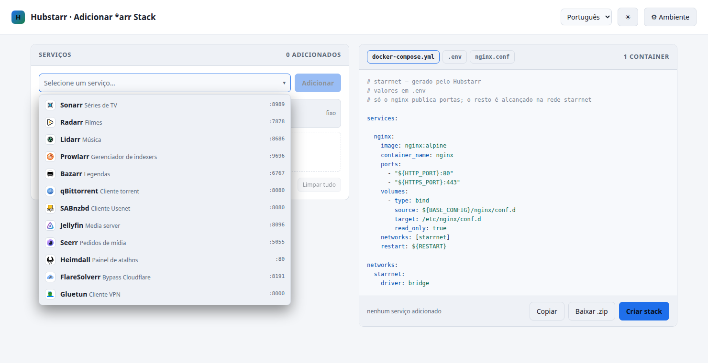
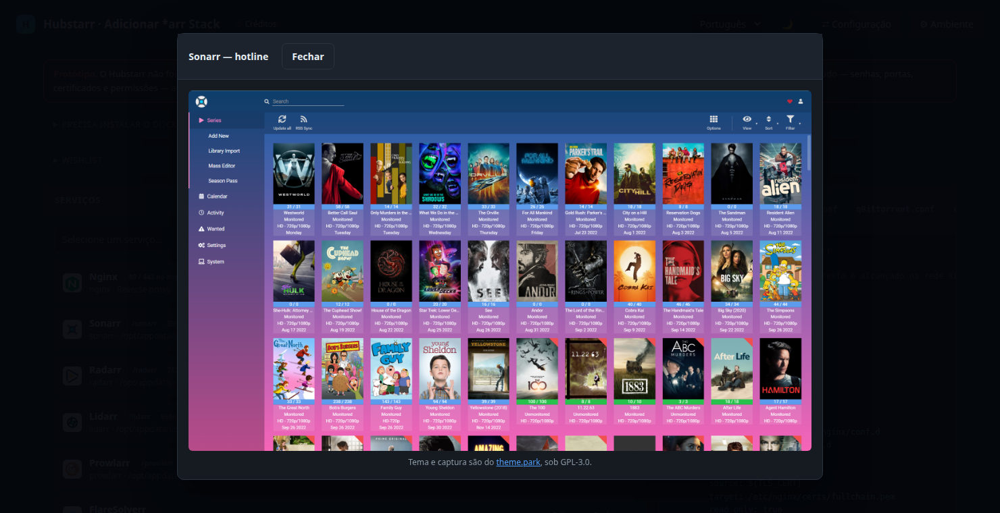
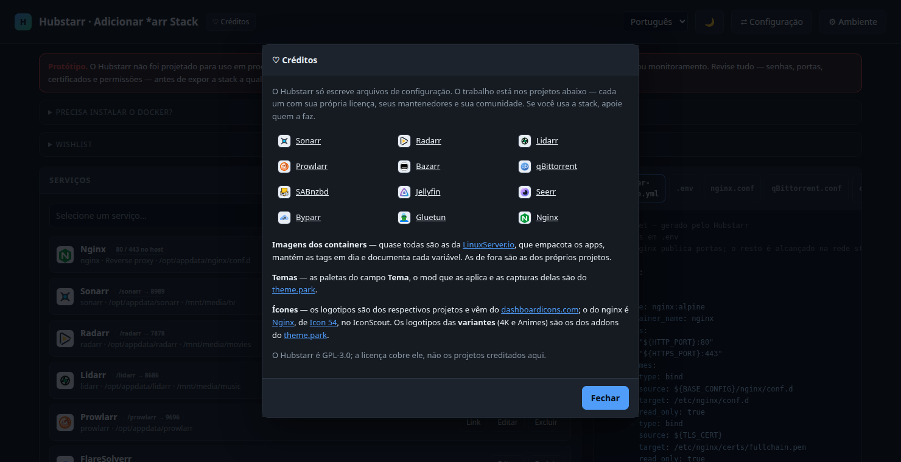
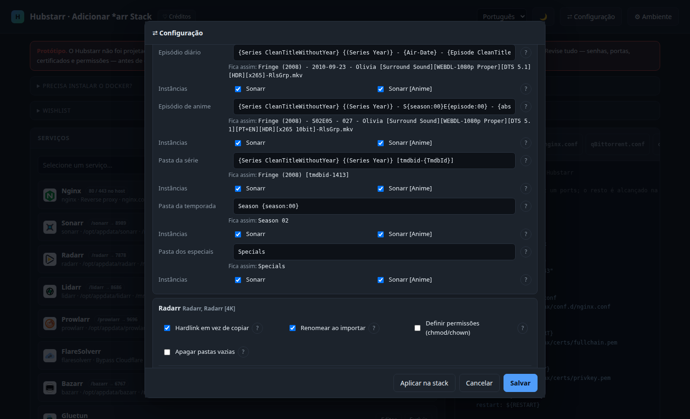

#  Hubstarr — *arr stack generator

*[Português (Brasil)](README.md) · English · [Español](README.es.md)*

[](LICENSE)

Single-page prototype that builds the `docker-compose.yml`, the `.env` and the
`nginx.conf` for a media stack (*arr apps + download clients + media server),
with no external dependencies. The page works on its own, opened from disk; an
[optional server](#optional-server) keeps the stacks in SQLite and brings the
stack up in Docker without going through the `.zip`.

> [!WARNING]
> **Prototype.** Hubstarr was not designed for production use: the files it
> generates are a starting point, with no security hardening, backups or
> monitoring. Review everything — passwords, ports, certificates and
> permissions — before exposing the stack to any network other than your own.

Open `hubstarr.html` in a browser. That's it — the file is
self-contained (the logos are embedded as data URIs). The **Environment** opens
with it: that is where the base paths everything else uses come from. Once
closed, it is still behind the button at the top.



The combobox lists the available services with their logos and default ports:



And the **Theme** field shows the chosen palette's screenshot without leaving the page:



## What you can do

- **Pick services** from a combobox with logos and add them to the stack.
- **Credits**, in the button next to the title: a modal with every project the
  stack uses — each app linking to its own site —, plus LinuxServer.io for the
  images, theme.park for the themes and where the icons come from.

  
- **Configure each instance** in a modal: title, media/downloads subfolder and
  VPN routing.
- **Copy each service's link**, with the scheme, address and subpath nginx will
  serve it on. The address is the Environment's domain when there is one; with
  none, it is the same one you opened the page on — reach it by the LAN IP and
  the links come out on that IP, not on `localhost`.
- **Conflict warning**: two instances pointed at the same folder step on each
  other when importing, so the list says so in red, with the names and the
  path. Jellyfin, which mounts the whole library, and Bazarr, which follows the
  others, are left out of the check.
- **Multiple instances** of Sonarr, Radarr, Lidarr, Bazarr and Prowlarr — they
  only need different titles. Sonarr and Radarr also get
  `SONARR__APP__INSTANCENAME` / `RADARR__APP__INSTANCENAME`.
- **Automatic base URL**: Sonarr, Radarr, Lidarr and Prowlarr get
  `<APP>__SERVER__URLBASE=/<container_name>`, already matching the nginx
  subpath. Bazarr exposes no such variable — set its base in its own UI.
- **API key** in the Environment: a single one for the whole stack. Sonarr,
  Radarr, Lidarr and Prowlarr land in the compose file with
  `<APP>__AUTH__APIKEY=${STARR_APIKEY}`, and SABnzbd with
  `SAB_API_KEY=${STARR_APIKEY}`; the value stays in `.env`. The key
  is generated up front — 16 random bytes in hex, the same as
  `openssl rand -hex 16` — and the "Generate" button rolls a new one.
- **Jellyfin hardware acceleration**: CPU, Intel or NVIDIA. Intel gets
  `devices: /dev/dri:/dev/dri`; NVIDIA gets the GPU reservation under `deploy`
  plus the `NVIDIA_VISIBLE_DEVICES` / `NVIDIA_DRIVER_CAPABILITIES` variables.
- **theme.park theme**: services on linuxserver images — Sonarr, Radarr,
  Lidarr, Prowlarr, Bazarr, qBittorrent, SABnzbd and Jellyfin — come
  out with `DOCKER_MODS=ghcr.io/themepark-dev/theme.park:<app>`, the mod that
  themes their interface. Sonarr and Radarr also get a **Variant** field in the
  modal, which becomes `TP_ADDON`: *Default* uses the darker addon
  (`sonarr-darker`), *4K* swaps logo and favicon for the 4K addon ones
  (`sonarr-4k-logo|sonarr-4k-favicon`) and *Anime* swaps both for the anime ones
  (`sonarr-anime-logo|sonarr-anime-favicon`) — handy to tell instances apart in
  a stack with more than one Sonarr or Radarr. Both also have a **Theme**
  field, the palette in `TP_THEME`: `aquamarine`, `hotline`, `hotpink`,
  `dracula`, `dark`, `organizr` (the default), `space-gray`, `overseerr` and
  `nord`. Below the field, a link shows the chosen palette's screenshot in a
  modal over the service's own; the image comes from the
  [theme.park](https://docs.theme-park.dev/) docs, one per app.
- **FlareSolverr alongside Prowlarr**: in the Prowlarr modal, a checkbox that
  is on by default brings FlareSolverr into the stack — it is what solves
  Cloudflare's anti-bot challenge on protected indexers. Set it up in Prowlarr
  under *Settings → Indexers → FlareSolverr*, with the URL
  `http://flaresolverr:8191`. The image behind it is
  [Byparr](https://github.com/ThePhaseless/Byparr), a drop-in, better-maintained
  replacement with the same API and the same port.
- **Per-field help** in the Environment and in the Configuration: every row has
  a `?` that opens an explanation of what the value does — and, in the
  Environment, of how it lands in the generated files.
- **Jellyfin's network.xml**: with it in the stack, its network configuration
  comes out too, with `BaseUrl` set to the nginx subpath and `nginx` in
  `KnownProxies` — without the first the UI builds its links at the root,
  without the second it logs the proxy's IP instead of the caller's. Mounted at
  `/config/config/network.xml`.
- **A ready qBittorrent.conf**: when it is in the stack, a fourth tab generates
  its initial configuration — paths matching the compose file, reverse-proxy
  settings and the credentials in qBittorrent 5.2's own format: the password as
  PBKDF2-SHA512 and the API key as `qbt_` plus 28 characters, derived from the
  stack's `${STARR_APIKEY}` — the conf is read by qBittorrent, not by compose,
  so the variable would not be expanded there. Username, password and key are
  edited in its modal — and it is the **API key** the *arr apps use to talk to
  it, not the password: it does not expire when the web UI password changes. The file is **not mounted**: qBittorrent owns it, and
  mounting ours would freeze everything it keeps in there. With a server,
  **Bring up** writes those keys into the conf the app created — stopping the
  container, making the change and starting it again, because it rewrites the
  whole file on exit. With no server, copy the tab's contents to the path shown
  at its top.
- **qBittorrent's categories.json**: next to the conf comes a second file with
  the categories **Configuration** gave each *arr, already created when it
  starts. Each one gets its own subfolder inside the download path — same
  partition, so the *arr keeps hardlinking instead of copying. Like the conf, it
  is not mounted: **Bring up** adds those categories to the ones the app already
  has, without dropping the ones you created in its own UI.
- **Optional HTTPS**, with the certificate and key coming from the host.
- **Configuration** (button at the top): pick which instances Prowlarr will
  configure, and the category each *arr uses in each download client —
  `tv-sonarr`, `radarr`, `lidarr` on qBittorrent, and SABnzbd's stock
  categories (`tv`, `movies`, `music`), all editable —,
  plus completed download handling on SABnzbd, and the *Media Management*
  options — hardlinks, renaming, permissions, empty
  folders, the **advanced** block (rescan folder, file date, recycling bin and
  its cleanup, import extra files, free space check) and each app's full naming section
  (*Episode*, *Movie*, *Track
  Naming*: illegal characters, colon replacement, multi-episode style and every
  file and folder format) — split per family: Sonarr, Radarr and Lidarr. The
  episode and movie formats ship with the [TRaSH
  Guides](https://trash-guides.info) ones, in the Jellyfin variant with the TMDb
  id. Permissions reveal the `chmod` and `chown` fields, and in Lidarr the existing
  name box is what brings up the track formats and the album folder.

  

  With more
  than one Sonarr in the stack, each of its formats — the three episode ones
  (**standard**, **daily** and **anime**) and the three folders (**series**,
  **season** and **specials**) — carries the list of instances that get it: you
  can send the anime format to *Sonarr [Anime]* only, say. Out of the box every instance gets
  every format; at least one is mandatory on the default format, because the
  field is mandatory in the app, and whichever you untick keeps the format it
  already has instead of losing it. All three parts of the Configuration reach
  the apps, through **Bring up** and **Apply to the stack**.
- **Global environment** (button at the top): base paths, PUID/PGID — which,
  with a server, already come from the user and group it runs as, the same one
  that creates the stack folders —, time zone,
  restart policy, API key and TLS. The
  time zone list is the whole IANA database, straight from the browser, and it
  starts on the machine's own zone.
- **Download** `docker-compose.yml`, `.env` and `nginx.conf`
  together in a `.zip` — the button stays in the bar while there is no server;
  with one, **Bring up** is what writes the files.
- **Switch languages** in the selector at the top: Portuguese (Brazil), English
  and Spanish.

## Docker

This section is also summarised on the page itself, in a collapsible notice
above the panels.

Hubstarr itself only needs a browser; it's the files it generates that need
Docker with the Compose plugin. On Linux, the official script does it:

```sh
curl -fsSL https://get.docker.com -o get-docker.sh
sudo sh get-docker.sh
```

On macOS and Windows — or on Linux, if you'd rather have a managed install with
a GUI — install [Docker Desktop][dd], which ships with Compose.

To use `docker` without `sudo`, add your user to the group — it takes effect on
the next session:

```sh
sudo usermod -aG docker $USER
```

[dd]: https://docs.docker.com/desktop/

With Docker in place, unzip the `.zip` and bring the stack up from the folder
holding the files:

```sh
docker compose up -d
```

## Optional server

The page is still the product: it is the one generating the files, and opened
from disk it works in full, with the `.zip` and nothing else. The server in
`backend/` adds what the browser cannot reach on its own — **keeping the stacks
between sessions**, writing the files to disk and bringing the stack up in
Docker; with it up, the `.zip` button leaves the bar, because **Bring up**
writes the same files. It never generates content: it receives ready-made
whatever the page's generators built.

Building and running it needs [Rust](https://rustup.rs):

```sh
cd backend
cargo run --release
```

Open `http://127.0.0.1:7878`. The page is the same one — served by the binary,
which carries it embedded — with two extras: the **server** badge at the top
and, in the generated files, the **Bring up** and **Tear down** buttons. On
load it asks the server whether `docker compose` is there; if it is not, it
warns and opens the **Need to install Docker?** block for you. With no
`docker compose` there, **Bring up** and **Tear down** are disabled, and the
button tooltip says why.

| Option     | Default                   | What it is                                   |
| ---------- | ------------------------- | -------------------------------------------- |
| `--addr`   | `127.0.0.1:7878`          | address the server listens on                 |
| `--dir`    | `./stack`                 | folder the generated files are written to     |
| `--db`     | `~/.hubstarr/hubstarr.db` | database the stack is kept in                 |
| `--docker` | `docker`                  | the docker command, for podman users          |

The stack lives in the database with its instances, Environment and
Configuration in tables of their own — the page state, normalized, not a JSON
blob. There is only one, the one in the `--dir` folder: to keep a second one,
point `--dir` and `--db` somewhere else.

A database from an earlier version, which held several stacks, is converted on
first open; the oldest stack is the one that stays, and the server prints the
folder each of the others wrote to, so you do not lose track of their files.

With a server, the screenshots behind the **Theme** field go through it too:
the first visit to each one reaches out to the theme.park docs and the ones
after it come off the disk, from a `shots/` folder next to the database. The
repository redistributes nobody's screenshots — the cache holds what you opened
yourself, and trims itself past 64 MB, oldest first. Deleting the folder by
hand breaks nothing: it costs one extra fetch. Opened from disk, with no
server, the page still fetches every screenshot straight from their docs.

Before bringing anything up, the server **creates the folders** the compose
volumes expect — configuration, media and downloads. Without that it is Docker
that creates them, as `root`, and the app cannot write in them. A path that
already exists and is not a folder stops Bring up right there, naming it in the
log.

**Bring up** leaves the stack configured: as soon as the apps answer, the
server registers every download client in every *arr **and in Prowlarr
itself** — which has its own Settings → Download Clients —, every *arr ticked
under Prowlarr's Settings → Apps, and each family's *Media Management* and
naming, all through their APIs, reporting what went through as it goes. The
**Apply to the stack** button, in the Configuration modal, does the same
without bringing anything up — it is the way to reapply after changing the
choices.

With **FlareSolverr** in the stack, Prowlarr also gets its proxy under
*Settings → Indexers → Indexer Proxies*, tagged **flaresolverr**. All that is
left is putting that tag on the indexers that need it — that is how Prowlarr
decides when to use the solver.

In Prowlarr, Settings → Download Clients gets **one entry per client**, all on
the `prowlarr` category: what it grabs is loose — it did not come from an *arr —
so it stays together, apart from what each instance downloads. And the
categories come to exist inside the client itself — each *arr's and Prowlarr's:
through `categories.json` in qBittorrent, and created through its own API in
SABnzbd, each with a folder of the same name inside the completed-downloads
directory. The apps are reached through
nginx, on the port it publishes on the host. Applying again does not duplicate
— the client is looked up by name and updated in place — and an app that is not
up yet becomes one line in the log instead of stopping the rest. SABnzbd needs
its API key, the one the app itself generates on first boot: copy it from
*Config → General* and paste it into the **API key** field of its modal.

> [!WARNING]
> The server runs `docker compose` and writes to disk: do not expose it to a
> network you do not trust. It listens on `127.0.0.1` only by default.

## Generated conventions

The stack and network names are fixed: `starrnet`. Each instance title becomes
a slug (lowercase, no accents, spaces turned into hyphens) used as the
`container_name`, the service key and the config folder:

| Title           | container_name | config                       |
| --------------- | -------------- | ---------------------------- |
| `Radarr`        | `radarr`       | `${BASE_CONFIG}/radarr`      |
| `Radarr [UHD]`  | `radarr-uhd`   | `${BASE_CONFIG}/radarr-uhd`  |

Paths come out as variables resolved by `.env`:

- `BASE_CONFIG` — root of the config folders, one per container.
- `BASE_MEDIA` — the library. Each *arr mounts its own subfolder, which starts
  out as its content type plus whatever tells the instance apart in the title
  (`Sonarr` → `tv`, `Sonarr 4K` → `tv-4k`, `Radarr [UHD]` → `movies-uhd`) and
  can be edited in the modal; Jellyfin mounts the whole base, and Bazarr
  follows the subfolders of the Radarr/Sonarr instances present in the stack.
- `DOWNLOAD_BASE` — the download area. qBittorrent and SABnzbd mount their own
  subfolder (`torrents`, `usenet`); the *arr apps mount the whole base at
  `/downloads`, so they can import.

In the modal, the subfolder field shows the resolved path and takes the
variables: typing `${BASE_MEDIA}` swaps in its value right away. Pointing
outside the bases — `/mnt/disk2/movies-4k`, say — is allowed, and then the
compose file carries that literal path, with no variable at all. Bazarr
follows: it mounts each instance's path as it ended up. So does Jellyfin: on
top of the whole base it gets one volume per folder left outside it, otherwise
that library would be invisible to it. Its modal also has a **+ folder** button
for directories no other service uses — an old disk, a network share. Each one
becomes a volume at `/data/<folder name>`.

Every volume uses the long syntax, with `type: bind` and
`bind.propagation: rslave`. The port is always the service's own, inside the
container: apart from nginx there is no host port to choose, and no conflict
to worry about.

| Service      | Internal port | Service      | Internal port |
| ------------ | ------------- | ------------ | ------------- |
| Sonarr       | `8989`        | Jellyfin     | `8096`        |
| Radarr       | `7878`        | Seerr        | `5055`        |
| Lidarr       | `8686`        | FlareSolverr | `8191`        |
| Prowlarr     | `9696`        | Gluetun      | `8000`        |
| Bazarr       | `6767`        | Nginx        | `80` / `443`  |
| qBittorrent  | `8181`        |              |               |
| SABnzbd      | `8080`        |              |               |

This is the port shown in the list next to the subpath, and the one nginx
`proxy_pass`es to. qBittorrent's is the one exception to the stock value: it
would listen on 8080, the same as SABnzbd, so it comes out with
`WEBUI_PORT=8181` in the compose and the matching `WebUI\Port` in the generated
conf. Nginx is the only one with two, and those are the ports inside the
container — the ones published on the host come from its own modal.

## Reverse proxy

nginx is fixed and mandatory: it is always in the stack, never shows up in the
combobox and cannot be removed. Apart from it, only **Seerr** publishes a port
on the host; everything else stays on the `starrnet` network, reached by nginx
at `container-name:internal-port`. Whatever routes through the VPN answers at
`gluetun`, which owns the network.

Both host ports live behind **Edit** on the nginx row: 80 and 443 by default,
but you can publish on 8080 and 8443, say, if something already holds the
privileged ones. They become `HTTP_PORT` and `HTTPS_PORT` in the `.env`; inside
the container nginx keeps listening on 80 and 443. The copied links and the
redirect to https already carry the chosen port.

The **nginx.conf** tab generates the matching configuration, routing by subpath
(`/sonarr`, `/radarr`…), one `location` per service. The file is mounted at
the container's `/etc/nginx/conf.d/nginx.conf`, from the `nginx.conf` in the
stack folder — the conf is generated along with the compose file and lives next
to it, not in `BASE_CONFIG`. With a server the path is spelled out, since it is
the one that knows where the stack lives; with no server it comes out as
`./nginx.conf`, relative to wherever the compose file is run from. Each app
needs its *base URL* to match its
subpath. No service sits at the root: the stack's `/` has no `location`, so it
is through each app's subpath that you get in.

Not every service becomes a route: `gluetun` and FlareSolverr only talk to the
other containers, so they get no `location` and no link button — Prowlarr
reaches FlareSolverr straight over the stack network.

**Seerr** and **qBittorrent** stay out of the proxy for the same reason: neither
has a configurable base URL, and an app without one cannot live in a subpath —
qBittorrent answers `500 Unacceptable file type` when it gets the prefix,
because it tries to serve the path as a file. Instead of a route, each
**publishes its port on the host** — 5055 and 8181 by default, editable in their
own modals, landing in the compose file as `ports` and in `.env` as
`SEERR_PORT` and `QBITTORRENT_PORT`. Their links point at those ports, over
`http://`: with no proxy in front, the stack's TLS does not cover them, and the
port has to be free on the machine. Whatever routes through the VPN publishes on
`gluetun`, which owns the network.

The Environment can turn **TLS** on: `nginx.conf` then gets a `server` on 443
with `ssl_certificate`, TLSv1.2/1.3, and a block on 80 that only redirects to
https. The certificate and the key are host paths, entered in the same place,
and land in the compose file as `${TLS_CERT}` and `${TLS_KEY}`, mounted
read-only at `/etc/nginx/certs`. Without TLS the stack stays on port 80 only.
The domain becomes the `server_name` (`_` when left empty).

## VPN

Marking a client as "route through gluetun" makes the service use
`network_mode: service:gluetun`, and gluetun joins the service list right
there, if it isn't in it yet. It becomes that service's address in nginx. The
credentials live behind **Edit on gluetun** — provider, tunnel type, WireGuard
keys or the OpenVPN username/password, and the server countries — and land in
`.env` as `VPN_SERVICE_PROVIDER`, `VPN_TYPE`, `WIREGUARD_*` or `OPENVPN_*` and
`SERVER_COUNTRIES`.

## Languages

The interface speaks Portuguese (Brazil), English and Spanish. The initial
language comes from `localStorage`, falling back to the browser's and finally
to Portuguese. The translation also covers the comments in the generated files
— the YAML, the `.env` and the `nginx.conf` come out in the chosen language.

Every visible string lives in the `I18N` dictionary at the top of the
`<script>`: one key per text, holding a string, or a function when it depends
on some data. In the HTML, static texts are marked with `data-i18n` (or
`data-i18n-html`, `data-i18n-ph`, `data-i18n-title`). Adding a language means
copying one of the blocks and translating the values.

## Wishlist

What is not there yet, in the order it would make sense to happen. The
milestones are versions, not dates: each one only starts after the previous, because
it depends on it. The repository is at **v0.3** today — the page, the optional
server that keeps the stacks and brings them up in Docker, and the Configuration
applied to the apps.

| Milestone | Delivers                                          | Done when                                                                          |
| --------- | ------------------------------------------------- | ---------------------------------------------------------------------------------- |
| ~~**v0.2**~~ | ~~A backend wiring `hubstarr.html` to Docker~~ | ✅ the page writes the files and brings the stack up without going through the `.zip` |
| ~~**v0.3**~~ | ~~Automatic stack configuration from the backend~~ | ✅ Prowlarr, download clients and Media Management leave the interface and become API calls |
| **v0.4**  | Custom formats and profiles per stack             | the 4K instance, the anime one and the rest are born with their own quality profile |
| **v0.5**  | Compatibility with the TRaSH Guides               | quality definitions, custom format scores and the rest of the guide's recommendations come ready |
| **v0.6**  | Localized media search                            | the search language can be picked and the *arr apps find the right release          |

## Status

The page is an interface prototype, but the **Configuration** is no longer just
interface: the choices are kept — in the page, and in the database when a server
is there — and, with a server and the stack up, all three of its parts turn into
API calls through **Apply to the stack**. The generated files were always the real thing —
download the `.zip` and run `docker compose up -d` in the folder you unpacked it
into, or let the server do both.

## License

[GNU General Public License v3.0](LICENSE) or later. Use, study, modify and
redistribute it freely; if you distribute a modified version, it has to ship
with the source and under the same license. No warranty — see sections 15 and
16 of the text.

The service logos belong to their own projects and come from
[dashboardicons.com](https://dashboardicons.com); the nginx one is
[Nginx](https://iconscout.com/icons/nginx) by
[Icon 54](https://iconscout.com/contributors/icon-54), on IconScout. The GPL
covers Hubstarr, not them.

The app themes come from [theme.park](https://theme-park.dev/), a separate
project also under GPL-3.0: the image the compose file uses in
`TP_THEME`/`TP_ADDON`, the palettes listed in the **Theme** field, the
screenshots Hubstarr shows and the 4K and Anime variant logos for Sonarr and
Radarr are all theirs.
